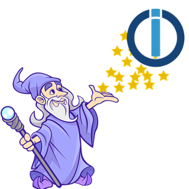

# ioBroker.ewelink

**Tests:** 

## ewelink adapter for ioBroker

Control [Sonoff](https://sonoff.tech/) / eWeLink switches on the local network using the
[DIY mode](https://sonoff.tech/diy-developer/) HTTP API. No eWeLink cloud account and no internet
connection are needed: the adapter talks to each device directly on TCP port 8081.

This version supports **single-channel switches** (e.g. Sonoff BASIC R3/R4, MINI R2/R3/R4, RFR3,
S26R2 plugs) — devices with one relay that report a `switch` value.

## Requirements

- Node.js 22 or newer, js-controller 6.0.11 or newer, admin 7.6.20 or newer
- Each device in **DIY mode**. On current firmware open the device in the eWeLink app and enable
  *LAN control* / *DIY mode*; older devices are switched with the method described on the
  [Sonoff DIY page](https://sonoff.tech/diy-developer/). Devices that are only in the normal
  (encrypted) eWeLink LAN mode answer with error 401 and are not supported.
- A fixed IP address (DHCP reservation) for each device, because the adapter addresses devices by IP.

## Configuration

| Setting | Meaning |
|---|---|
| **Devices** | One row per switch: active, name, IP address or host name, port (8081, the DIY mode default) and an optional device ID. The name becomes the object-tree folder (`ewelink.0.<name>`); leave it empty to use the IP address. The device ID is only needed if a device rejects requests without it (error 404) — the adapter otherwise learns it from the device. |
| **Poll interval** | How often each device is asked for its switch state, 5–3600 s (default 10 s). |

Deactivating a row keeps the device's objects (and their history/alias settings); deleting the row
removes them at the next start.

## States

| State | Type | Meaning |
|---|---|---|
| `info.connection` | boolean | At least one device is reachable |
| `<device>.control.power` | boolean, writable | Relay on/off. Write `true`/`false` to switch; acknowledged once the device has accepted the command |
| `<device>.info.reachable` | boolean | The device answers (goes `false` after two failed polls in a row) |
| `<device>.info.firmware` | string | Firmware version |
| `<device>.info.deviceId` | string | eWeLink device ID |
| `<device>.info.signalStrength` | number (dBm) | WiFi signal strength, where the firmware reports it |

## Disclaimer

Sonoff and eWeLink are trademarks of their respective owners (ITEAD Intelligent Systems Co., Ltd. and
CoolKit Technologies). This adapter is not affiliated with or endorsed by them.

## Changelog
<!--
    Placeholder for the next version (at the beginning of the line):
    ### **WORK IN PROGRESS**
-->

### **WORK IN PROGRESS**
* (Alan Paris) initial release

## License
MIT License

Copyright (c) 2026 Alan Paris <alan.paris@scottish.rugby>

Permission is hereby granted, free of charge, to any person obtaining a copy
of this software and associated documentation files (the "Software"), to deal
in the Software without restriction, including without limitation the rights
to use, copy, modify, merge, publish, distribute, sublicense, and/or sell
copies of the Software, and to permit persons to whom the Software is
furnished to do so, subject to the following conditions:

The above copyright notice and this permission notice shall be included in all
copies or substantial portions of the Software.

THE SOFTWARE IS PROVIDED "AS IS", WITHOUT WARRANTY OF ANY KIND, EXPRESS OR
IMPLIED, INCLUDING BUT NOT LIMITED TO THE WARRANTIES OF MERCHANTABILITY,
FITNESS FOR A PARTICULAR PURPOSE AND NONINFRINGEMENT. IN NO EVENT SHALL THE
AUTHORS OR COPYRIGHT HOLDERS BE LIABLE FOR ANY CLAIM, DAMAGES OR OTHER
LIABILITY, WHETHER IN AN ACTION OF CONTRACT, TORT OR OTHERWISE, ARISING FROM,
OUT OF OR IN CONNECTION WITH THE SOFTWARE OR THE USE OR OTHER DEALINGS IN THE
SOFTWARE.